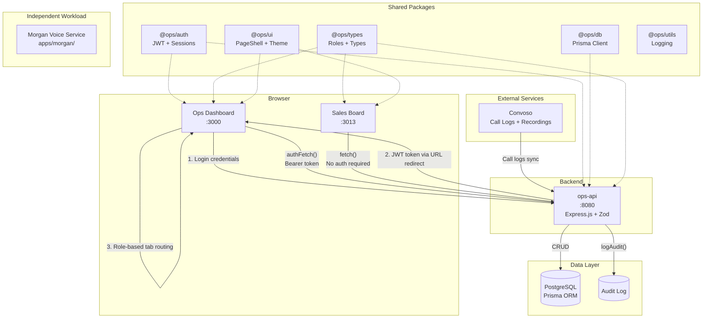
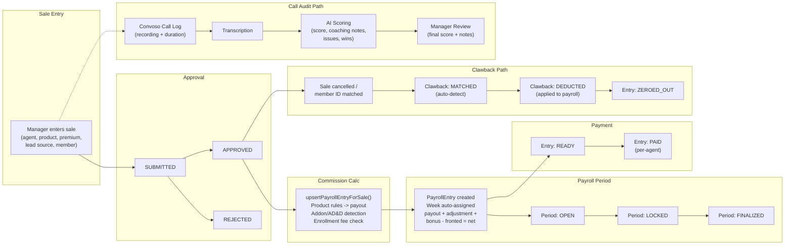
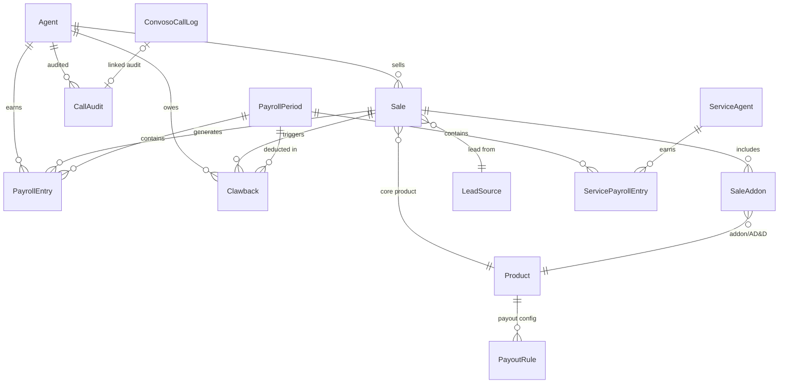

# INS Internal Operations Platform (Railway Monorepo)

This repository contains **two independent workloads in one Railway project**:

1. **Morgan voice service** -- AI calling system at `apps/morgan/` (Convoso + Vapi integration).
2. **Ops Platform** -- sales operations suite under `apps/` and `packages/`.

## System Architecture



### Role-Based Access

| Role | Dashboard View | Capabilities |
|------|---------------|--------------|
| `SUPER_ADMIN` | All tabs | Full access, bypasses all role checks |
| `MANAGER` | Manager tab | Sales entry, agent tracking, call audits, config |
| `PAYROLL` | Payroll tab | Payroll periods, commissions, clawbacks, exports |
| `OWNER_VIEW` | Owner tab | Read-only KPI and operational overview |
| `CUSTOMER_SERVICE` | CS tab | Chargeback and pending terms management |
| `SERVICE` | -- | Customer service operations |
| `ADMIN` | -- | Administrative functions |

## Data Flow -- Sale Lifecycle



### Key Data Relationships



## Monorepo Layout

```text
.
├── apps/
│   ├── morgan/          # Voice service (Node.js/Express)
│   ├── ops-api/         # REST API (Express + Prisma)
│   ├── ops-dashboard/   # Unified dashboard (Next.js 15)
│   └── sales-board/     # Public leaderboard (Next.js 15)
├── packages/
│   ├── auth/     # JWT + sessions
│   ├── db/       # Prisma client
│   ├── types/    # Roles + shared types
│   ├── ui/       # PageShell + theme
│   └── utils/    # Structured logging
├── prisma/
│   ├── schema.prisma
│   └── seed.ts
└── package.json
```

## Service Responsibilities

- **ops-api**: Auth, session endpoints, RBAC middleware, business logic (sales, payroll, clawbacks, commissions), exports API, AI call scoring, Socket.IO real-time events.
- **ops-dashboard**: Unified dashboard with role-based views -- Manager (sales entry, agent tracker, call audits, config), Payroll (periods, commissions, clawbacks, exports), Owner (KPI summary, agent KPIs, permissions, AI scoring), CS (chargeback/pending terms submission and tracking).
- **sales-board**: Read-only public sales leaderboard with day/week toggle and real-time WebSocket updates.
- **morgan**: AI voice calling service -- Convoso lead queue management, Vapi outbound call orchestration, multi-slot concurrent dialing, business hours enforcement.

## Shared Auth/Session

- Cookie name: `ops_session`.
- JWT issued by `ops-api` using `AUTH_JWT_SECRET`.
- Cookie domain set via `AUTH_COOKIE_DOMAIN` (e.g. `.yourdomain.com`) so all subdomains can read/write session cookie.
- All protected apps must call `/api/session/me` and enforce role-level access.
- Logout clears cookie with same domain/path.

## Environment Variables

### ops-api

- `DATABASE_URL`
- `PORT`
- `AUTH_JWT_SECRET`
- `AUTH_COOKIE_DOMAIN`
- `AUTH_PORTAL_URL`
- `ALLOWED_ORIGINS`

### ops-dashboard

- `NEXT_PUBLIC_OPS_API_URL`

### sales-board

- `NEXT_PUBLIC_OPS_API_URL`

### morgan

- `CONVOSO_AUTH_TOKEN`
- `VAPI_API_KEY`
- `VAPI_MORGAN_ASSISTANT_ID`
- `VAPI_PHONE_NUMBER_IDS`
- `MORGAN_ENABLED`
- `PORT`
- `LOG_LEVEL`

## Local Development

Morgan voice service:
```bash
npm ci
node apps/morgan/index.js
```

Ops workspace services (install from monorepo root so workspace links resolve):
```bash
npm install
npm run db:migrate
npm run db:seed
npm run ops:dev          # ops-api on :8080
npm run dashboard:dev    # ops-dashboard on :3000
npm run salesboard:dev   # sales-board on :3013
```

## Morgan Tests

```bash
npm test                          # run all Morgan tests
npm test -- helpers.test.js       # single file
npm test -- -t "test name"        # by name
npm run test:watch                # watch mode
npm run test:coverage             # with coverage
```

Test files live in `apps/morgan/__tests__/`.

## Morgan Known Issues

The Morgan voice service has 19 documented code-level issues from a Feb 2026 audit.
The 3 highest-severity items (race condition, memory leak, single-lead bottleneck) were fixed.

Remaining open issues by category:

- **Error handling:** Inconsistent 429 handling, no retry for failed Convoso updates, silent webhook failures
- **Data validation:** No webhook payload validation, unsafe string-to-number conversion
- **Configuration:** Phone number count not enforced
- **Performance:** Inefficient queue hydration, synchronous request processing
- **Code quality:** Monolithic index.js (1500+ lines), mixed logging, global mutable state
- **Security:** No rate limiting on webhook endpoints

These are documented for awareness. Morgan is working in production and these issues are deferred to post-launch.

## Railway Deployment

Use **separate Railway services**. Because this is an npm workspaces monorepo, each workspace service should install from repo root and run commands for its workspace.

| Service | Root directory | Build command | Start command |
|---|---|---|---|
| `ai-calling-backend` (Morgan) | `.` | `npm ci --workspaces=false` | `npm start` |
| `ops-api` | *(blank / unset)* | `npm ci && npm run build -w @ops/ops-api` | `npm run start -w @ops/ops-api` |
| `ops-dashboard` | *(blank / unset)* | `npm ci && npm run build -w @ops/ops-dashboard` | `npm run start -w @ops/ops-dashboard` |
| `sales-board` | *(blank / unset)* | `npm ci && npm run build -w @ops/sales-board` | `npm run start -w @ops/sales-board` |

Recommended watch paths:

- **Morgan:** `/apps/morgan/**`, `/package.json`, `/package-lock.json`
- **ops-api:** `apps/ops-api/**`, `packages/**`, `prisma/**`
- **ops-dashboard:** `apps/ops-dashboard/**`, `packages/**`
- **sales-board:** `apps/sales-board/**`, `packages/**`

> Morgan watch paths in Railway UI may need manual update from root paths to `apps/morgan/` paths.

### Railway Private Networking Notes

- Use Railway internal URL for `ops-api` between internal services.
- Frontend public domains call public URL or proxied domain.
- Keep inter-service auth on private network where feasible for admin actions.

### Manual Railway + DNS Follow-Up

1. Create/add domains:
   - `dashboard.<domain>` (ops-dashboard)
   - `salesboard.<domain>` (sales-board)
2. Set `AUTH_COOKIE_DOMAIN=.<domain>` for all auth/session-aware services.
3. Provision Railway Postgres and share `DATABASE_URL` to `ops-api`.
4. Run migrations + seed on `ops-api`.
5. Configure role users and rotate seeded passwords immediately.
6. Keep Morgan deploy settings untouched to avoid cross-impact.

## Deployment Crash Prevention

Key deployment pitfalls documented from past incidents:

1. **Never hardcode `output: "standalone"` in next.config.js** -- use conditional
   `process.env.NEXT_OUTPUT_STANDALONE === "true" ? "standalone" : undefined`.
   Only Docker builds set this var. Railway uses `next start` which is incompatible.

2. **Dockerfile CMD must use shell form** -- exec form `["node", "..."]` doesn't
   expand `${APP_NAME}`. Use `CMD node apps/${APP_NAME}/server.js`.

3. **Postgres `depends_on` needs `condition: service_healthy`** -- plain `depends_on`
   doesn't wait for postgres to accept connections.

4. **`NEXT_PUBLIC_*` vars are build-time only** -- set as build args, not runtime env.

5. **`NEXT_PUBLIC_OPS_API_URL` must be browser-reachable** -- never use Docker
   internal hostnames like `http://ops-api:8080`.
